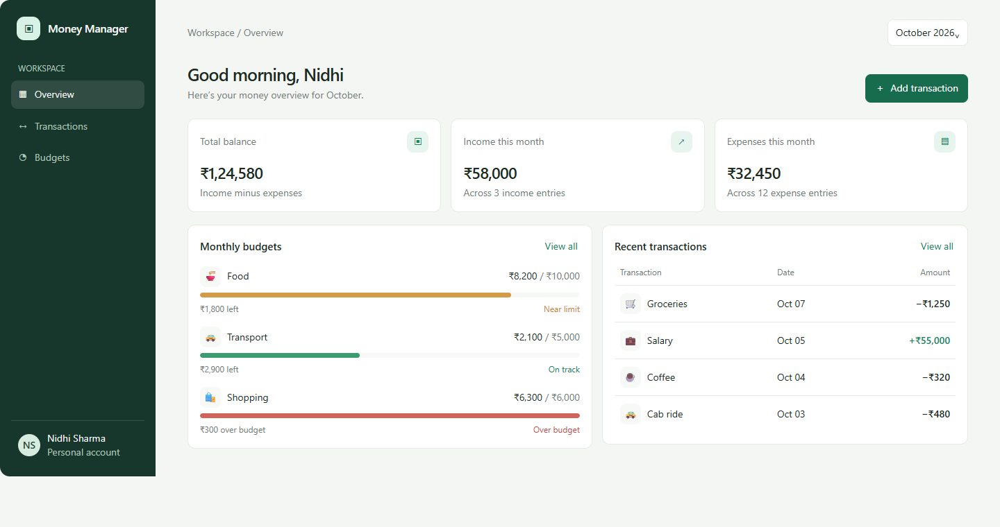
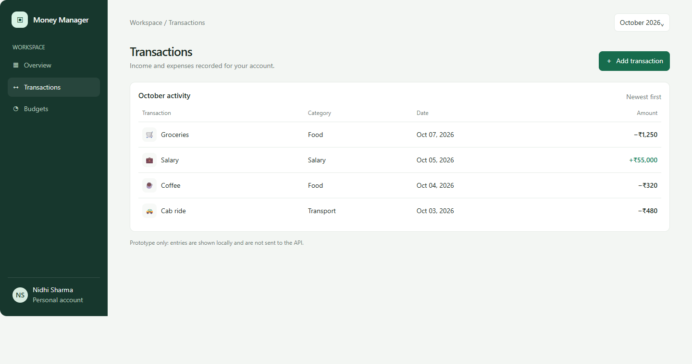
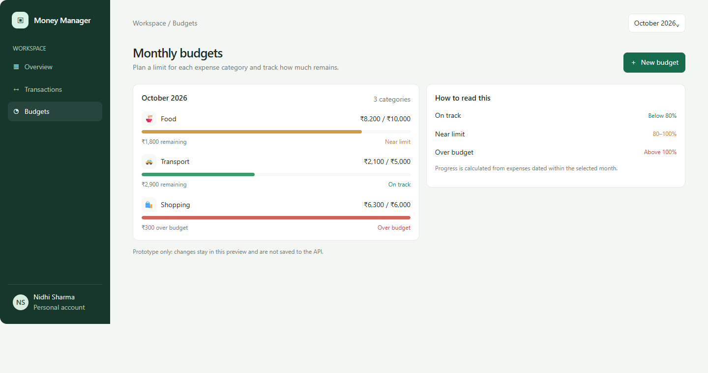
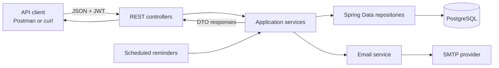
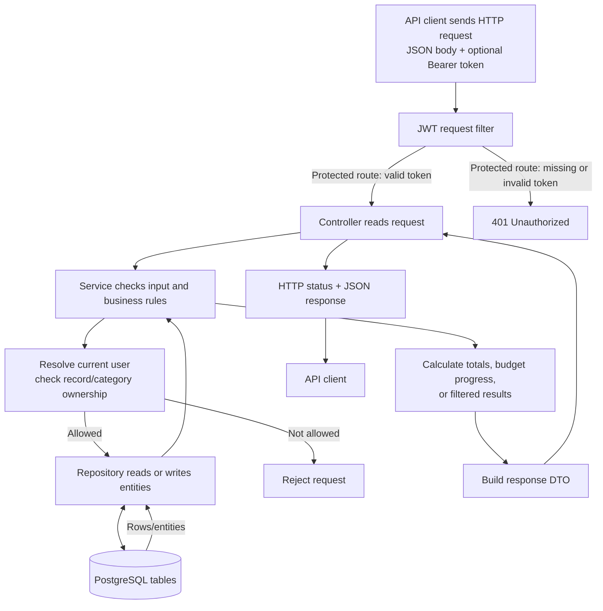
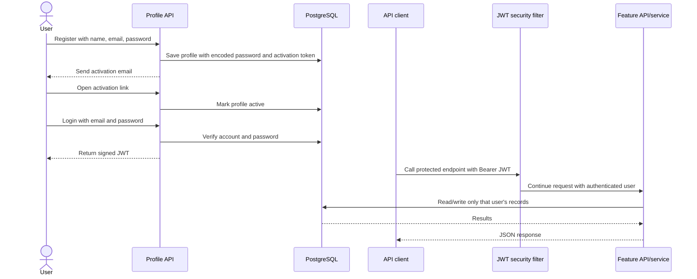
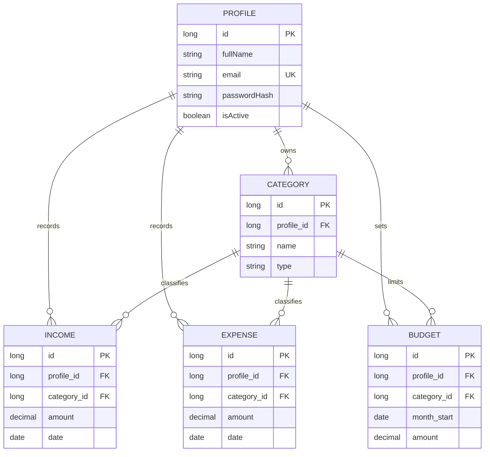

# Money Manager API

Money Manager is a personal-finance **backend API** built with Java and Spring Boot. A signed-in user can record income and expenses, organize transactions by category, review dashboard totals, filter transactions, and set monthly spending limits for expense categories.

The repository exposes its functionality through REST endpoints.

## Why this project exists

The goal is to make personal spending easier to understand. Recording a transaction is only the starting point: users can set a monthly limit for a category and compare that limit with their actual spending. The API reports budget utilization and flags budgets that are nearing or over their limit.

## Main features

- Register an account, activate it through email, and sign in to receive a JWT.
- Store income, expenses, and categories per user.
- Enforce authentication on personal-data endpoints and check ownership of categories and transactions.
- View a dashboard with income, expense, balance, recent transactions, and current-month budget status.
- Filter income or expenses by date range, name, and sort order.
- Create or update one monthly budget for each expense category.
- Get daily reminder and expense-summary emails from scheduled jobs.

## UI/UX concept

The images below show a design concept for the API. The values are illustrative sample data; the images are not connected to a running UI or API.



<details>
<summary>View the Transactions and Budgets screens</summary>

### Transactions



### Budgets



</details>

## Technology

- Java 21
- Spring Boot 3.5
- Spring Web and Spring Security
- JWT (JJWT)
- Spring Data JPA / Hibernate
- PostgreSQL
- Maven
- Spring Mail

## How the application fits together



The client sends JSON to a controller. For protected requests it also sends `Authorization: Bearer <token>`. Spring Security validates the JWT, the service applies the current user's ownership rules, and repositories read or write data in PostgreSQL. Controllers return DTOs rather than exposing JPA entities directly.

### Where request data goes

This diagram follows data from the moment an API request arrives until the response is returned. A request without a valid token is stopped before it reaches a protected controller. Registration, activation, login, and health checks are public endpoints.



For example, `POST /expenses` sends a JSON expense and category id into this flow. The service finds the signed-in profile, confirms that the category belongs to that profile, saves an `ExpenseEntity` in `tbl_expenses`, then returns an `ExpenseDTO` as JSON. `GET /budgets?month=YYYY-MM` reads that user's budgets and expenses for the month, calculates spent/remaining/utilization/status, and returns the calculated budget DTOs.

### Sign-in and request flow



### Data model



A budget belongs to one user and one expense category for one month. The database has a uniqueness constraint on `(profile, category, month_start)`, so saving the same category/month updates its budget instead of creating a duplicate.

## Run locally

### Requirements

- JDK 21
- PostgreSQL running locally
- A database named `moneymanager`
- SMTP settings if you want registration emails and scheduled notifications to send

The default local datasource in `src/main/resources/application.properties` is:

```text
jdbc:postgresql://localhost:5434/moneymanager
username: postgres
password: password
```

Change these local values if your PostgreSQL installation uses a different port or credentials. The app listens on port `8082` by default. Hibernate is configured with `ddl-auto=update` for this project, so it creates/updates tables when the application starts.

Run from the repository root:

```powershell
.\mvnw.cmd spring-boot:run
```

Or run `MoneymanagerApplication` from your IDE. For a local run, leave the `prod` profile inactive. `application-prod.properties` is for deployment and expects `SPRING_DATASOURCE_URL`, `SPRING_DATASOURCE_USERNAME`, and `SPRING_DATASOURCE_PASSWORD` to be set in the process environment.

Email configuration also uses environment variables: `BREVO_USERNAME`, `BREVO_PASSWORD`, `BREVO_FROM_EMAIL`, `MONEY_MANAGER_FRONTEND_URL`, and `MONEY_MANAGER_BACKEND_URL`. The `MONEY_MANAGER_FRONTEND_URL` value is just the destination inserted into reminder emails; this repository does not include a UI. Provide the values for email features and never commit real credentials or production secrets.

When the app starts successfully, check the health endpoint:

```text
GET http://localhost:8082/health
```

It should return `Application is running`.

## Verify it with Postman

Use `http://localhost:8082` as the base URL. Complete the steps in order. Registration requires working email configuration because the activation token is sent by email.

1. **Register** — `POST /api/v1.0/register`, JSON body:

   ```json
   {
     "fullName": "Example User",
     "email": "you@example.com",
     "password": "choose-a-password"
   }
   ```

2. **Activate the account** — open the activation link received by email. It calls `GET /api/v1.0/activate?token=...`.

3. **Log in** — `POST /api/v1.0/login`, JSON body:

   ```json
   {
     "email": "you@example.com",
     "password": "choose-a-password"
   }
   ```

   Copy the `token` from the response. For all following requests, set the Authorization type to **Bearer Token** in Postman and paste the token.

4. **Create an expense category** — `POST /categories`:

   ```json
   {
     "name": "Food",
     "type": "expense",
     "icon": "🍜"
   }
   ```

   Save the returned category `id`.

5. **Set a monthly budget** — `PUT /budgets`:

   ```json
   {
     "categoryId": 1,
     "month": "2026-10",
     "amount": 500.00
   }
   ```

   Use the category id you received. The month must be `YYYY-MM`; use the current month if you want current-month expenses included.

6. **Add an expense** — `POST /expenses`:

   ```json
   {
     "name": "Groceries",
     "categoryId": 1,
     "amount": 35.50,
     "date": "2026-10-07",
     "icon": "🛒"
   }
   ```

7. **Check budget progress** — `GET /budgets?month=2026-10`. The response includes `spent`, `remaining`, `utilizationPercent`, and `status`:

   - `ON_TRACK`: below 80% of the limit
   - `NEAR_LIMIT`: at least 80%, but not over the limit
   - `OVER_BUDGET`: spending is greater than the limit

8. **See the combined dashboard** — `GET /dashboard`. It includes overall income/expense totals, recent records, and current-month `monthlyBudgets`.

If you already have an activated account, start from step 3. For a quick auth check, try `GET /dashboard` once without a token (it should be rejected), then with a valid token (it should return JSON).

## API reference

All routes below are relative to `http://localhost:8082`. Except for registration, activation, login, and health endpoints, requests require a valid JWT.

| Method | Route | Purpose |
| --- | --- | --- |
| `GET` | `/health` or `/status` | Health check |
| `POST` | `/api/v1.0/register` | Register a user |
| `GET` | `/api/v1.0/activate?token=...` | Activate account from email link |
| `POST` | `/api/v1.0/login` | Authenticate and receive a JWT |
| `GET` | `/api/v1.0/test` | Protected authentication check |
| `GET` | `/categories` | List the current user's categories |
| `GET` | `/categories/{type}` | List categories by type (`income` or `expense`) |
| `POST` | `/categories` | Create a category |
| `PUT` | `/categories/{categoryId}` | Update a category owned by the current user |
| `GET` | `/income` | List current-month income |
| `POST` | `/income` | Add income |
| `DELETE` | `/income/{id}` | Delete owned income |
| `GET` | `/expenses` | List current-month expenses |
| `POST` | `/expenses` | Add expense |
| `DELETE` | `/expenses/{id}` | Delete owned expense |
| `POST` | `/filter` | Filter income/expenses by type, dates, keyword, and sort |
| `GET` | `/dashboard` | Get totals, recent transactions, and current-month budgets |
| `PUT` | `/budgets` | Create/update a monthly category budget |
| `GET` | `/budgets?month=YYYY-MM` | Get budget progress for a month |

### Budget behavior

- Budgets only accept categories of type `expense` that belong to the signed-in user.
- The amount must be greater than zero.
- Saving the same category and month updates the existing budget.
- `spent` is calculated from that user's expenses in the requested calendar month.
- `remaining` bottoms out at zero after overspending; `utilizationPercent` can exceed 100.
- If `month` is omitted from `GET /budgets`, the current month is used.

## Project structure

```text
src/main/java/com/nidhisn/moneymanager/
├── config/       Spring Security and CORS configuration
├── controller/   HTTP routes and request/response handling
├── dto/          API data transfer objects
├── entity/       JPA database entities
├── repository/   Spring Data database access
├── security/     JWT request filter
├── service/      Application and business logic
└── util/         JWT creation and parsing
```

## Talking about this project

**Why build it?** It applies backend concepts to a familiar problem: people need to understand where their money goes. The project started with tracking transactions, then grew into a more useful tool by adding category budgets and spending progress.

**What happens when a user adds an expense?** The request reaches `ExpenseController`, the JWT filter establishes the current user, `ExpenseService` checks that the category belongs to that user, and `ExpenseRepository` saves the record. The response is an `ExpenseDTO`.

**How do budgets add value?** A CRUD transaction list only stores records. Budgets compare monthly category limits with actual expenses, calculate utilization and remaining money, and identify when a category is close to or over its limit.

**What would you improve next?** Add automated tests for authentication, ownership isolation, budget calculations, and invalid inputs; validate DTOs; replace schema auto-update with migrations; and use a managed secret for JWT signing in production.

## Current scope and known limitations

- The budget progress view is an API response, not a visual chart or web screen.
- Tests are not currently included in `src/test`.
- Local configuration is for development. Before deployment, configure production credentials and a strong JWT secret outside the repository.
